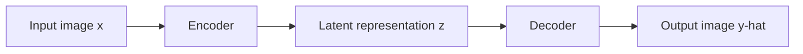
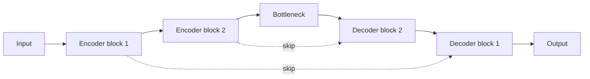

# CNN-Based Encoder–Decoder Architectures for Images

## Learning objectives

After studying this material, you should be able to:

- explain the roles of an encoder, a latent representation, and a decoder;
- trace the shape of an image tensor through a convolutional encoder–decoder;
- use convolution for downsampling and transposed convolution or resize-convolution for upsampling;
- explain how the bottleneck affects the information learned by a network;
- describe why skip connections are useful; and
- connect encoder–decoder networks to autoencoders, VAEs, GANs, and diffusion models.

## 1. What is an encoder–decoder architecture?

An encoder–decoder is a general neural-network design with two main components:

1. The **encoder** converts an input into an internal representation.
2. The **decoder** uses that representation to construct an output.

For an input image $x$, the encoder $f_\theta$ produces a latent representation $z$:

$$
z = f_\theta(x)
$$

The decoder $g_\phi$ produces the prediction $\hat{y}$:

$$
\hat{y} = g_\phi(z)
$$

The complete model is therefore

$$
\hat{y} = g_\phi\left(f_\theta(x)\right).
$$



Encoder–decoder networks are used in many image tasks:

- **reconstruction:** reproduce the input image;
- **denoising:** map a noisy image to a clean image;
- **segmentation:** map an image to a pixel-wise class mask;
- **super-resolution:** map a low-resolution image to a high-resolution image;
- **inpainting:** fill missing regions of an image; and
- **image-to-image translation:** map one image domain to another.

For four common image tasks, the training input and target output are:

| Task | Input | Target output |
|---|---|---|
| Standard autoencoding (reconstruction) | Original image | The same original image |
| Denoising | Image with added noise | Corresponding clean image |
| Inpainting | Image with missing or masked regions | Corresponding complete image |
| Super-resolution | Low-resolution image | Corresponding high-resolution image |

The target is the desired output used to supervise training; the decoder learns to produce an image that matches it. These input–target pairs can often be created from original images by adding noise, masking regions, or downsampling. Standard autoencoding uses each original image as both the input and the target, without requiring class labels.

> An encoder–decoder is an architectural pattern. An autoencoder is a particular way of training that architecture, with the input image also used as the target.

### 1.1 Real-world use case: detecting product defects

A standard autoencoder can use image reconstruction to help detect defects in manufactured products, such as scratches on metal surfaces or cracks in ceramic tiles. This is useful when images of normal products are plentiful but examples of defects are rare or varied.

The autoencoder is trained using images of **defect-free products**:

- **Training input:** an image of a normal product.
- **Training target:** the same image.
- **Training objective:** minimize the difference between the input and its reconstruction, commonly using mean squared error (MSE).

With a constrained latent representation, the model learns patterns common to normal products, such as their shapes and textures. During inspection, a new product image is passed through the autoencoder, and its reconstruction is compared with the input.

| Image being inspected | Expected reconstruction behavior |
|---|---|
| Normal product | Familiar patterns are reconstructed accurately, giving low reconstruction error. |
| Defective product | Unfamiliar defects may be reconstructed poorly, giving higher error around the defect. |

For example, if the input shows a tile with a crack, the autoencoder might reconstruct a smoother surface. A map of the differences between the input and reconstruction can help locate the crack, while an overall reconstruction-error score can be compared with a threshold to flag the tile for inspection. The reconstruction is therefore an intermediate step toward **detecting unusual regions**, without needing labeled training examples of every possible defect.

This behavior is not guaranteed: an autoencoder can sometimes reconstruct defects too, and normal variations in lighting or texture can increase reconstruction error. Detection performance and the threshold must therefore be validated on representative inspection images.

## 2. Images as tensors

PyTorch normally represents a batch of images using a four-dimensional tensor:

$$
[N, C, H, W],
$$

where:

- $N$ is the batch size;
- $C$ is the number of channels;
- $H$ is the image height; and
- $W$ is the image width.

For example, a batch of 32 RGB images of size $64 \times 64$ has shape:

```text
[32, 3, 64, 64]
```

Shape tracking is important because the output of the encoder must be compatible with the input expected by the decoder.

## 3. The convolutional encoder

An image encoder usually performs two operations at the same time:

1. It extracts increasingly meaningful visual features.
2. It reduces the spatial dimensions of the feature maps.

A common pattern is:

```text
spatial resolution: decreases   64 -> 32 -> 16 -> 8
number of channels: increases    3 -> 32 -> 64 -> 128
```

Early layers often detect local features such as edges and textures. Deeper layers combine them into more abstract features such as shapes or object parts.

### 3.1 Convolution

A two-dimensional convolution applies a collection of learnable filters to an input. For one spatial dimension, its output size is

$$
H_{out} =
\left\lfloor
\frac{H_{in} + 2P - D(K-1) - 1}{S}
\right\rfloor + 1,
$$

where $K$ is kernel size, $S$ is stride, $P$ is padding, and $D$ is dilation.

For example, a $3 \times 3$ convolution with stride 2 and padding 1 approximately halves the image height and width:

```python
layer = nn.Conv2d(
    in_channels=1,
    out_channels=16,
    kernel_size=3,
    stride=2,
    padding=1,
)
```

### 3.2 Downsampling

**Downsampling** reduces the height and width of feature maps as they pass through the encoder. At the same time, the network commonly increases the number of channels:

```text
[N,   3, 64, 64]
          ↓
[N,  32, 32, 32]
          ↓
[N,  64, 16, 16]
          ↓
[N, 128,  8,  8]
```

The spatial resolution decreases, while the additional channels allow the network to represent a larger collection of learned features.

#### Why downsample?

**1. To reduce computation and memory.** A $64 \times 64$ feature map contains 4096 spatial positions, whereas a $32 \times 32$ feature map contains only 1024. Halving both dimensions therefore reduces the number of spatial positions by a factor of four. This makes deeper convolutional processing more efficient, although the actual saving also depends on the number of channels.

**2. To increase the effective receptive field.** A feature's **receptive field** is the region of the original image that can affect it. After downsampling, a convolution in a deeper layer covers a larger area of the original image. This allows early layers to detect edges and textures while deeper layers combine them into shapes, object parts, and other higher-level patterns.

For example, two $3 \times 3$ convolutions with stride 2 give a second-layer feature an effective receptive field of $7 \times 7$ pixels in the original image.

**3. To learn more abstract features.** Exact pixel positions become less prominent as resolution decreases. The network becomes more concerned with whether useful patterns are present than with small pixel-level variations. This can provide some robustness to small translations and local changes.

**4. To create an information bottleneck.** For tasks such as reconstruction, the encoder should retain information needed by the decoder and discard less useful detail. Reducing spatial resolution can contribute to this bottleneck, but it does not guarantee dimensional compression because the number of channels may increase.

#### Common downsampling operations

An encoder can reduce resolution using the following operations.

**Strided convolution** learns both the feature extraction and downsampling operation:

```python
downsample_conv = nn.Conv2d(
    in_channels=16,
    out_channels=32,
    kernel_size=3,
    stride=2,
    padding=1,
)
```

**Max pooling** keeps the largest activation in each local region:

```python
max_pool = nn.MaxPool2d(kernel_size=2, stride=2)
```

**Average pooling** keeps the average activation in each local region:

```python
average_pool = nn.AvgPool2d(kernel_size=2, stride=2)
```

Strided convolutions are common in generative models because their downsampling filters are learned. Pooling is simpler and has no learned parameters, but its aggregation operation is fixed.

#### The information-loss trade-off

Downsampling inevitably removes some spatial detail. Aggressive downsampling can lose small objects, sharp edges, and exact locations. A decoder cannot perfectly recover information that was discarded; it can only construct a plausible output using the retained latent features and patterns learned from the training data.

Architectures requiring precise spatial outputs often use skip connections to pass higher-resolution encoder features directly to the decoder. These are discussed in Section 8.

### 3.3 Example encoder

The following encoder maps a $28 \times 28$ grayscale image to a spatial latent tensor of shape $[32, 7, 7]$:

```python
import torch
import torch.nn as nn


class Encoder(nn.Module):
    def __init__(self):
        super().__init__()
        self.network = nn.Sequential(
            # [N, 1, 28, 28] -> [N, 16, 14, 14]
            nn.Conv2d(1, 16, kernel_size=3, stride=2, padding=1),
            nn.ReLU(),

            # [N, 16, 14, 14] -> [N, 32, 7, 7]
            nn.Conv2d(16, 32, kernel_size=3, stride=2, padding=1),
            nn.ReLU(),
        )

    def forward(self, x):
        return self.network(x)
```

## 4. The latent representation and bottleneck

The encoder output $z$ is called the **latent representation**, **code**, or **bottleneck representation**. It should retain information that the decoder needs while discarding irrelevant detail.

There are two common forms: a **latent vector**, often produced by a fully connected (`Linear`) bottleneck, and a **spatial latent representation**, produced by convolutions. The choice determines how the latent features are connected and organized for the decoder.

### 4.1 Latent vector

A latent vector has shape

$$
[N, D],
$$

where $N$ is the batch size and $D$ is the latent dimension. For example, a batch of 32 images represented by 128 features has shape `[32, 128]`.

To produce a latent vector, the encoder normally flattens its final feature maps and passes them through a linear layer:

```python
class VectorEncoder(nn.Module):
    def __init__(self, latent_dim=128):
        super().__init__()
        self.convolutions = nn.Sequential(
            nn.Conv2d(1, 16, 3, stride=2, padding=1),
            nn.ReLU(),
            nn.Conv2d(16, 32, 3, stride=2, padding=1),
            nn.ReLU(),
        )
        self.to_latent = nn.Sequential(
            nn.Flatten(),
            nn.Linear(32 * 7 * 7, latent_dim),
        )

    def forward(self, x):
        features = self.convolutions(x)  # [N, 32, 7, 7]
        z = self.to_latent(features)      # [N, 128]
        return z
```

This is a **linear bottleneck**: `Flatten` rearranges the feature maps into 1568 values per image, and `Linear` learns to combine them into 128 latent features. Each output feature can depend on every input channel and spatial position, with separate learned weights for those inputs. Flattening alone does not compress the representation; the reduction happens in the linear layer.

The vector represents the image globally. Its features can contain information about shapes, textures, or object identity, but they no longer have explicit height and width coordinates. The decoder must therefore learn how to reconstruct a spatial arrangement from this global representation.

A vector decoder commonly uses a linear layer to expand the vector and then reshapes the result into feature maps:

```python
self.from_latent = nn.Sequential(
    nn.Linear(latent_dim, 32 * 7 * 7),
    nn.ReLU(),
    nn.Unflatten(dim=1, unflattened_size=(32, 7, 7)),
)
```

Latent vectors are useful when:

- one compact embedding is required for each image;
- global semantic information is more important than precise location;
- latent vectors will be interpolated, clustered, or visualized;
- the model uses fully connected layers at its bottleneck; or
- the input images have a fixed size.

They are commonly used in **classical autoencoders and introductory VAEs. A basic GAN** also begins with a randomly sampled vector, although that vector is an input to its generator rather than the output of an image encoder:


### 4.2 Spatial latent representation

A **spatial latent representation** stores learned image features in a grid. Think of it as a coarse map describing **what features are present and approximately where they occur**. Its shape is

$$
[N, C_z, H_z, W_z],
$$

where $C_z$, $H_z$, and $W_z$ are the number of latent channels, height, and width. The encoder shown in Section 3.3 directly produces such a representation:

```python
z = encoder(x)

print(x.shape)  # [N, 1, 28, 28]
print(z.shape)  # [N, 32, 7, 7]
```

Here, each image is represented by 32 feature maps of size $7 \times 7$. These are learned features, rather than a smaller copy of the original image. Each grid location contains 32 feature values describing information associated with that location.

For example, suppose an image contains a car on the left and a tree on the right. The latent grid can keep features associated with the car toward the left and features associated with the tree toward the right. This gives the decoder a coarse layout to work from when constructing the output.

Each latent location can receive information from an overlapping region of the input, called its **receptive field**. Deeper features may use information from a large part of the image, so a grid location does not represent only one small, isolated patch.

Unlike a vector representation, no flattening is required:

```text
Input image                  Spatial latent
[N, 1, 28, 28]  --------->  [N, 32, 7, 7]

height and width retained at a lower resolution
```

#### Example: a convolutional bottleneck

The encoder in Section 3.3 already produces a spatial latent without a separate bottleneck layer. To also reduce its channel count, we can keep the convolutional feature extractor from `VectorEncoder` and replace `Flatten` and `Linear` with a $1 \times 1$ convolution:

```python
class SpatialEncoder(nn.Module):
    def __init__(self, latent_channels=8):
        super().__init__()
        self.convolutions = nn.Sequential(
            nn.Conv2d(1, 16, 3, stride=2, padding=1),
            nn.ReLU(),
            nn.Conv2d(16, 32, 3, stride=2, padding=1),
            nn.ReLU(),
        )
        self.to_latent = nn.Conv2d(
            in_channels=32,
            out_channels=latent_channels,
            kernel_size=1,
        )

    def forward(self, x):
        features = self.convolutions(x)  # [N, 32, 7, 7]
        z = self.to_latent(features)     # [N, 8, 7, 7] with default channels
        return z


spatial_encoder = SpatialEncoder(latent_channels=8)
x = torch.randn(4, 1, 28, 28)
z = spatial_encoder(x)
print(z.shape)  # torch.Size([4, 8, 7, 7])
```

The $1 \times 1$ convolution learns to combine 32 input channels into 8 output channels **at each grid location**, applying the same weights at all 49 locations. It preserves the $7 \times 7$ grid and does not mix neighboring locations itself; the preceding $3 \times 3$ convolutions have already gathered neighborhood information. A larger bottleneck kernel, such as $3 \times 3$ with padding 1, could also mix neighboring features while preserving the grid size.

Compare the two paths:

```text
Linear bottleneck:
[N, 32, 7, 7] → Flatten → Linear(1568, 128) → [N, 128]

Convolutional bottleneck:
[N, 32, 7, 7] → Conv2d(32, 8, kernel_size=1) → [N, 8, 7, 7]
```

Here, `latent_channels=8` means 8 features **per location**, giving $8 \times 7 \times 7 = 392$ latent values per image. By comparison, `latent_dim=128` means 128 values for the entire image. These examples therefore have different latent sizes. The spatial decoder receives 8-channel feature maps and can upsample them directly, without `Linear` or `Unflatten`.

#### Why is a spatial grid useful?

1. **It gives the decoder a spatial starting point.** When removing noise from an image, for example, a car should stay in the same place. The grid helps the decoder relate output regions to the corresponding input regions.
2. **It lets convolutions work with neighboring features.** Decoder layers can combine nearby grid values to build shapes and textures, applying the same learned filters across the image.
3. **It can avoid a large fully connected layer.** The decoder can process the grid directly, without first expanding a vector using `Linear` and `Unflatten`. A fully convolutional design can also support different image sizes, subject to constraints such as compatible downsampling dimensions.

A latent vector can also encode object positions. The difference is that its values are not explicitly organized into a height–width grid; the decoder must learn how to turn that vector back into a spatial arrangement.

#### When is it used?

| Image task | Why a spatial latent helps |
|---|---|
| Reconstruction | Gives the decoder a coarse layout from which to reconstruct the original image. |
| Denoising | Helps remove noise while keeping objects and boundaries in their original locations. |
| Segmentation | Keeps features organized by location to help predict a class for each output pixel. |
| Super-resolution | Provides a layout for generating a larger image with objects in corresponding positions. |
| Inpainting | Provides context around a missing region so the decoder can fill it consistently with its surroundings. |
| Image-to-image translation | Helps preserve scene layout while changing appearance, such as turning a photograph into a painting. |

Architectures such as **fully convolutional autoencoders** and **U-Net** use spatial feature maps for these kinds of tasks. U-Net also passes higher-resolution encoder features to the decoder through skip connections. Autoencoders used in latent diffusion models likewise produce spatial latents. A VAE can use either a vector or a spatial latent: its probabilistic formulation does not require a linear bottleneck.

#### What does a spatial latent preserve?

It preserves **coarse spatial organization**, but it does not guarantee that every edge or texture survives. Downsampling can still discard fine details. Skip connections can provide higher-resolution features to help the decoder produce accurate boundaries and textures.

The main differences are summarized below:

| Property | Latent vector | Spatial latent representation |
|---|---|---|
| Shape | `[N, D]` | `[N, C_z, H_z, W_z]` |
| Explicit spatial layout | No height–width grid; position can still be encoded | Retained as a coarse grid |
| Typical bottleneck layers | `Flatten` and `Linear` | Convolutional layers |
| Bottleneck connectivity | Each output can combine all input positions and channels | Each output combines features within the convolution's kernel |
| Weight sharing | Separate weights for different input positions | Same filters at every spatial position |
| Decoder entry | Usually `Linear` followed by reshape | Convolutions can process the grid directly |
| Best suited to | Global image representation | Spatially aligned image tasks |
| Common examples | Basic autoencoder, introductory VAE | U-Net, restoration, latent diffusion |

Here, **linear** refers to a fully connected layer, not the absence of nonlinear activations throughout the network. Convolution is also a linear operation before bias or activation; the architectural difference is its local connectivity and shared weights.

A useful selection rule is:

> A vector is a useful choice for a single embedding of an image. A spatial latent is a useful choice when the decoder benefits from features arranged by location.

Reduced spatial resolution does not necessarily mean fewer total values. In the Section 3.3 encoder, the input contains $1 \times 28 \times 28 = 784$ values, while the latent tensor contains $32 \times 7 \times 7 = 1568$ values. It is a hidden feature representation, but it is not dimensionally compressed. The `SpatialEncoder` above reduces this to $8 \times 7 \times 7 = 392$ values, so it does provide dimensional compression relative to the input. To claim compression, compare the total number of latent values—or the information capacity—with that of the input.

### 4.3 Bottleneck size

The bottleneck controls the model's information capacity:

- If it is **too small**, important information may be lost and outputs may lack detail.
- If it is **too large**, the network may copy the input without learning useful abstractions.
- Its best size depends on the data and the task.

Dimensionality alone does not guarantee a useful latent space. The loss function, training data, architecture, and any additional regularization also determine what the representation learns.

### 4.4 Upsampling

**Upsampling** increases the height and width of feature maps as they pass through the decoder. The number of channels commonly decreases as the representation approaches the required output image:

```text
[N, 128,  8,  8]
          ↓
[N,  64, 16, 16]
          ↓
[N,  32, 32, 32]
          ↓
[N,   3, 64, 64]
```

#### Why upsample?

**1. To restore spatial resolution.** The encoder's latent representation is usually smaller than the required image or pixel-wise output. Upsampling returns it to the required height and width.

**2. To convert abstract features into pixels.** The latent representation describes high-level visual content. As resolution increases, decoder layers translate those features into progressively finer shapes, edges, textures, colours, and ultimately pixel values.

**3. To produce dense predictions.** Tasks such as segmentation, reconstruction, super-resolution, inpainting, and denoising require a value at every output location. Upsampling turns coarse semantic features into these spatially dense predictions.

The process can be understood as a gradual transformation:

```text
coarse semantic features
        ↓
object shapes and spatial layout
        ↓
edges, textures, and colours
        ↓
output pixels
```

Upsampling is not simply the exact reverse of downsampling. Once the encoder discards information, increasing tensor dimensions does not automatically restore it. The decoder learns to generate a plausible output from the information that remains. Skip connections can provide higher-resolution encoder features when the task requires accurate spatial detail.

Common upsampling methods include:

- transposed convolution;
- nearest-neighbour or bilinear interpolation followed by convolution; and
- pixel shuffle, particularly in super-resolution networks.

The next section explains the first two methods and implements the convolutional decoder.

## 5. The convolutional decoder

The decoder reverses the overall spatial trend of the encoder. It increases image resolution while converting learned features into output pixels.

Two widely used approaches are transposed convolution and resize-convolution.

### 5.1 Transposed convolution

A transposed convolution is a learnable upsampling operation. It is not the mathematical inverse of a convolution, even though it is sometimes informally called a *deconvolution*.

For one spatial dimension, its output size is

$$
H_{out} = (H_{in}-1)S - 2P + D(K-1) + O + 1,
$$

where $O$ is `output_padding`.

```python
layer = nn.ConvTranspose2d(
    in_channels=32,
    out_channels=16,
    kernel_size=3,
    stride=2,
    padding=1,
    output_padding=1,
)
```

### 5.2 Resize followed by convolution

Another approach first resizes the feature maps and then applies a normal convolution:

```python
self.up_block = nn.Sequential(
    nn.Upsample(scale_factor=2, mode="bilinear", align_corners=False),
    nn.Conv2d(32, 16, kernel_size=3, padding=1),
    nn.ReLU(),
)
```

This approach separates upsampling from feature extraction and can reduce the checkerboard artifacts sometimes produced by transposed convolution.

### 5.3 Example decoder

This decoder maps the encoder's $[N, 32, 7, 7]$ latent tensor back to a $28 \times 28$ grayscale image:

```python
class Decoder(nn.Module):
    def __init__(self):
        super().__init__()
        self.network = nn.Sequential(
            # [N, 32, 7, 7] -> [N, 16, 14, 14]
            nn.ConvTranspose2d(
                32, 16, kernel_size=3, stride=2,
                padding=1, output_padding=1
            ),
            nn.ReLU(),

            # [N, 16, 14, 14] -> [N, 1, 28, 28]
            nn.ConvTranspose2d(
                16, 1, kernel_size=3, stride=2,
                padding=1, output_padding=1
            ),
            nn.Sigmoid(),
        )

    def forward(self, z):
        return self.network(z)
```

The final `Sigmoid` is appropriate when target pixels have been scaled to $[0,1]$.

## 6. A complete image encoder–decoder

The two components can now be combined:

```python
class ImageEncoderDecoder(nn.Module):
    def __init__(self):
        super().__init__()
        self.encoder = Encoder()
        self.decoder = Decoder()

    def forward(self, x):
        z = self.encoder(x)
        output = self.decoder(z)
        return output, z


model = ImageEncoderDecoder()
x = torch.rand(8, 1, 28, 28)

output, z = model(x)

print("Input shape: ", x.shape)       # [8, 1, 28, 28]
print("Latent shape:", z.shape)       # [8, 32, 7, 7]
print("Output shape:", output.shape)  # [8, 1, 28, 28]
```

The architecture alone does not decide what task the network performs. That depends on the training pairs:

```text
Task                 Input x              Target y
----------------------------------------------------------------
Reconstruction       original image       original image
Denoising            noisy image          clean image
Segmentation         original image       segmentation mask
Super-resolution     low-resolution       high-resolution image
Inpainting           masked image         complete image
```

## 7. Training objective

The encoder and decoder are normally trained together by minimizing a loss between the predicted output and target:

$$
\mathcal{L}(\theta,\phi)
= D\left(y, g_\phi(f_\theta(x))\right).
$$

A minimal reconstruction step is:

```python
import torch.nn.functional as F

optimizer = torch.optim.Adam(model.parameters(), lr=1e-3)

output, z = model(images)
loss = F.mse_loss(output, images)

optimizer.zero_grad()
loss.backward()
optimizer.step()
```

Common image losses include:

| Loss | Typical use | Important property |
|---|---|---|
| Mean squared error (MSE) | Reconstruction | Penalizes large pixel errors; may produce smooth outputs |
| Mean absolute error (L1) | Restoration and translation | Often preserves edges better than MSE |
| Binary cross-entropy | Binary or suitably normalized data | Requires compatible targets and output activation |
| Perceptual loss | Visually realistic reconstruction | Compares learned features instead of only pixels |

The output activation and data normalization must agree:

| Target pixel range | Typical output activation |
|---|---|
| $[0,1]$ | `Sigmoid` |
| $[-1,1]$ | `Tanh` |
| Unrestricted real values | No bounded activation |

## 8. Skip connections

Compressing all information through a bottleneck can remove fine spatial details. A **skip connection** sends encoder features directly to a corresponding decoder stage.



Features may be added or concatenated:

```python
decoder_features = torch.cat(
    [decoder_features, encoder_features], dim=1
)
```

Skip connections:

- preserve edges and spatial detail;
- improve gradient flow;
- allow the bottleneck to focus on higher-level information; and
- form the central idea behind U-Net, which is widely used in diffusion models.

They must be designed carefully. If the task requires removing information, an unrestricted shortcut may allow unwanted input features to bypass the bottleneck.

## 9. Common design problems

### Shape mismatch

The most common implementation error is an unexpected decoder output size. Write down the shape after every block and test the network with a small random tensor before training.

### Checkerboard artifacts

Some combinations of transposed-convolution kernel size and stride produce uneven overlap. Resize-convolution is a common alternative.

### Incorrect output range

A `Sigmoid` output cannot represent negative normalized pixels. Similarly, using `Tanh` while targets lie in $[0,1]$ creates an unnecessary mismatch.

### Weak or excessive bottleneck

An extremely narrow bottleneck may destroy important content. An extremely wide bottleneck may fail to encourage useful representation learning.

### Confusing channels and spatial dimensions

PyTorch uses `[N, C, H, W]`, not `[N, H, W, C]`. Passing the wrong layout to `Conv2d` causes errors or incorrect behavior.

## 10. Connection to generative models

The encoder–decoder pattern will reappear throughout image generation:

### Autoencoder

The encoder deterministically maps $x$ to $z$, and the decoder reconstructs the same image:

$$
x \rightarrow z \rightarrow \hat{x}.
$$

### Variational autoencoder

The encoder predicts parameters such as $\mu$ and $\log \sigma^2$ for a probability distribution. A latent vector is sampled from that distribution and passed to the decoder.

### Generative adversarial network

A basic GAN normally has no encoder. Its generator behaves like a decoder: it maps a random latent vector to an image.

### Diffusion model

The denoising network is often a U-Net—a convolutional encoder–decoder with skip connections, time-step conditioning, and frequently attention.

### Latent diffusion model

An image encoder first compresses an image into a spatial latent representation. Diffusion operates in that smaller latent space, and an image decoder converts the result back to pixels.

## 11. Check your understanding

1. What information should an encoder preserve for image reconstruction?
2. Why do encoders often increase channel count while decreasing spatial resolution?
3. What is the difference between a latent vector and a spatial latent representation?
4. Is a transposed convolution the exact inverse of a convolution?
5. When would skip connections be especially helpful?
6. How does an autoencoder differ from a general encoder–decoder?
7. For the example network, what happens to the shapes if the input is $32 \times 32$ instead of $28 \times 28$?

## Summary

- An encoder transforms an image into a latent representation.
- A decoder transforms that representation into an output image or pixel-wise prediction.
- Convolutions and striding commonly perform feature extraction and downsampling.
- Transposed convolution or resize-convolution commonly performs upsampling.
- The bottleneck controls how much and what kind of information can pass through the network.
- Skip connections preserve spatial detail and are essential to architectures such as U-Net.
- The training target and loss determine whether the same architecture performs reconstruction, denoising, segmentation, super-resolution, or another task.
- Autoencoders, VAEs, GAN generators, and diffusion networks all build on these ideas.
